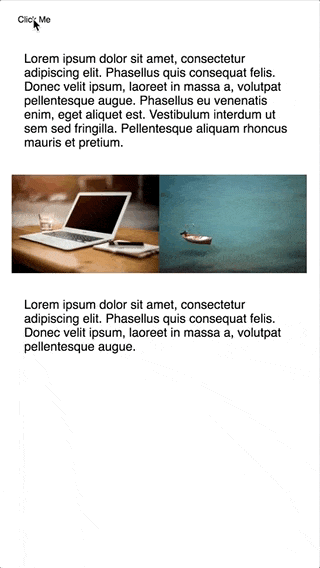
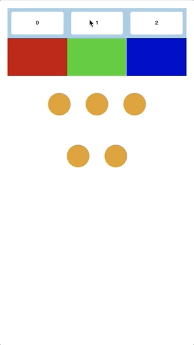

# react-layout-transition
Trying to make layout transitions simple

This project aims to provide React components that can :sparkles:_automagically_:sparkles: animate between changes in your layout.
Inspired by existing solutions on native platforms, it hopes to bring similar functionality and ease to the web.

These are some great pieces with example code on how to use the native platform feature
- [React Native’s LayoutAnimation is Awesome](https://medium.com/@Jpoliachik/react-native-s-layoutanimation-is-awesome-4a4d317afd3e) - Justin Poliachik (Medium)
- [Animate all the Things. Transitions in Android](https://medium.com/@andkulikov/animate-all-the-things-transitions-in-android-914af5477d50) - Andrey Kulikov (Medium)

**Note:** This is a very early implementation so do expect loads of bugs and missing features (but also be sure to report them)

## SharedElementTransitionGroup

A container around the views to transition between that animates shared elements, between their initial and final position.
It classifies elements as shared if you mark them with the same id in both the intial and final layout component and does the rest for you.

Check out the following demo at [https://react-layout-transition.surge.sh/](https://react-layout-transition.surge.sh)



```jsx
class Demo extends React.Component {
    state = {
        switch: true,
    };

    toggle = () => {
        this.setState((prevState) => ({
            switch: !prevState.switch,
        }));
    };

    render() {
        return (
            <div>
                <button onClick={this.toggle}>Click Me</button>
                <SharedElementTransitionGroup>
                    {this.state.switch && <Page1 />}
                    {!this.state.switch && <Page2 />}
                </SharedElementTransitionGroup>
            </div>
        );
    }
}

class Page1 extends React.Component {
    render() {
        const cont = {
            display: 'flex',
            flexDirection: 'row',
            justifyContent: 'center',
            alignItems: 'center',
            width: '100%',
            overflow: 'hidden',
        };

        const img1Style = {
            maxWidth: '100%',
            height: 'auto',
        };

        const img2Style = {
            maxWidth: '100%',
            height: 'auto',
        };

        return (
            <div style={this.props.style} ref={this.props.innerRef}>
                <p>...</p>
                <div style={cont}>
                    // this is where the magic happens ✨
                    
                    
                </div>
                <p>...</p>
            </div>
        );
    }
}

class Page2 extends React.Component {
    render() {
        const imgStyle = {
            width: '100%',
            height: 'auto',
        };

        return (
            <div style={this.props.style} ref={this.props.innerRef}>
                // this is where the magic happens ✨
                
                <p>...</p>
                
            </div>
        );
    }
}

```

## LayoutTransitionGroup

A component that animates state based changes in layout in certain parts of your view.<br>
Currently the implementation does not accomodate a very general use case



```jsx
class Demo extends LayoutTransitionGroup {
    state = {
        count: 3,
    };

    increment = () => {
        // this is where the magic happens ✨
        this.beginTransition(this.listRef, (prevState) => ({
            count: prevState.count + 1,
        }));
    };

    render() {
        const linearStyle = {
            minHeight: '100%',
            width: '100%',
            display: 'flex',
            flexDirection: 'column',
            justifyContent: 'center',
            alignItems: 'center',
        };

        const childStyle = (i) => ({
            textAlign: 'center',
            width: '100%',
            padding: '16px',
            backgroundColor: `rgb(${(60*(i+1)) % 255}, 50, ${(40 * (i+1)) % 255})`,
        });

        return (
            <div>
                <button onClick={this.increment}>Click Me</button>
                <div 
                    style={linearStyle}
                    ref={(ref) => {
                        this.listRef = ref;
                    }}
                >
                    {[...Array(this.state.count).keys()].map((i) => <div style={childStyle(i)} key={i}>{i}</div>)}
                </div>
            </div>
        );
    }
}

```

You can find the code for the above demos in the example directory

## Usage

`npm install --save react-layout-transition`

This currently requires babel transpilation as the library does not ship any processed code for now

Please do report any bugs you encounter and point to me any examples and use cases that could be used to improve this

If you like the direction the project is headed in and want to help please do reach out!
